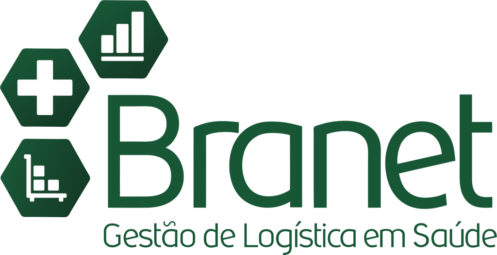
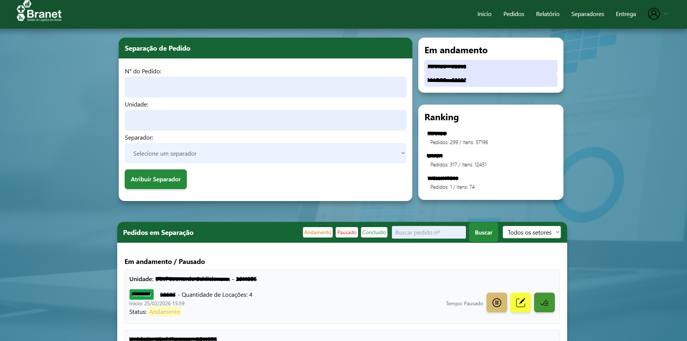
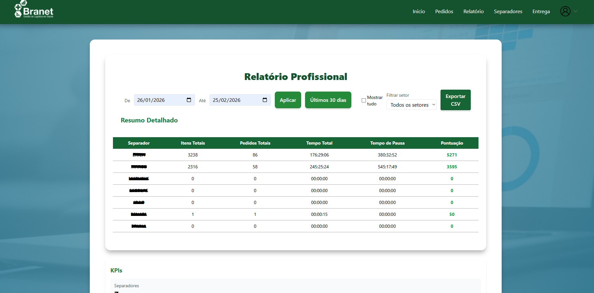

<!-- HEADER BADGES -->

  

<h1 align="center">Sistema Web Corporativo - Django</h1>

  
  
  
  
  

---

## 📌 Sobre o Projeto

Este é um **sistema web corporativo completo**, desenvolvido com **Django** e integrado com **PostgreSQL** em produção, com autenticação segura de usuários, controle de acesso, gerenciamento de dados e deploy em ambiente cloud.

O projeto representa uma aplicação real de backend em empresa, demonstrando organização de código, segurança, arquitetura escalável e boas práticas de desenvolvimento.

---

## 🖼️ Visualizações do Sistema

  

  

  

---

## 🚀 Funcionalidades / Features

### 🔐 Autenticação e Segurança
- Login e logout de usuários
- Criptografia de senhas
- Proteção de rotas reservadas
- Perfil novo somente com autorização do ADMIN

### 🗄️ Banco de Dados (PostgreSQL)
- Conexão com banco em produção
- Modelos definidos com Django ORM

### 📋 CRUD Completo
- Cadastro, leitura, edição e remoção de dados
- Interface intuitiva via templates

### 🌐 Ambiente de Produção
- Deploy no **Render**
- Configuração de **variáveis de ambiente**  
  (`SECRET_KEY`, `DATABASE_URL`, `DEBUG=false`)

---

## 🏗️ Arquitetura

O projeto segue o padrão **MTV (Model-Template-View)** do Django:

---

## 📂 Estrutura do Projeto

Empresa/
│── manage.py  
│── projeto/  
│   │── settings.py  
│   │── urls.py  
│   │── wsgi.py  
│── app/  
│   │── models.py  
│   │── views.py  
│   │── urls.py  
│   │── templates/  
│   │── static/  
│── requirements.txt  

Organização baseada na arquitetura padrão do Django, garantindo manutenção e escalabilidade.

---

- ✅ **Models** → estrutura de dados e regras de negócio  
- ✅ **Views** → lógica da aplicação e processamento  
- ✅ **Templates** → páginas HTML renderizadas  
- ✅ **Configurações separadas** para desenvolvimento e produção

---

## 🛠️ Tecnologias Utilizadas

- 🐍 Python  
- 🟢 Django  
- 🐘 PostgreSQL  
- 🖥️ HTML / CSS / Bootstrap  
- ☁️ Render (Deploy)

---

**Sabrina Gama** – Desenvolvedora Backend em formação

